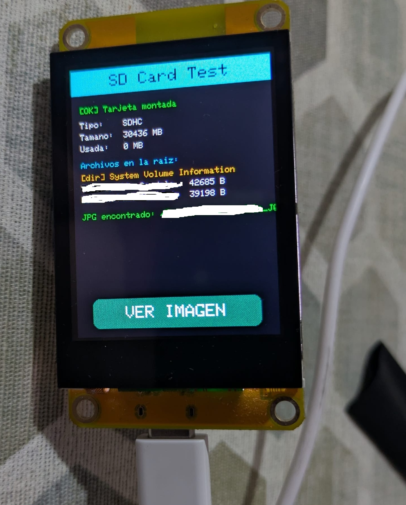

# SD Card Test - ESP32-2432S022

Sketch de prueba para el lector de microSD integrado en la placa
ESP32-2432S022. Monta la tarjeta, muestra su información y lista los
archivos de la raíz en pantalla. Si encuentra un `.jpg`, permite verlo
a pantalla completa tocando el botón **VER IMAGEN**.

## Qué hace

1. Inicializa pantalla (ST7789, bus paralelo) y táctil (CST816S)
2. Monta la tarjeta microSD por SPI (bus VSPI)
3. Muestra en pantalla:
   - Estado del montaje (`[OK]` / `[ERROR]`)
   - Tipo de tarjeta (MMC / SDSC / SDHC)
   - Tamaño total y espacio usado
   - Listado de archivos/carpetas de la raíz (hasta 10)
4. Si detecta un `.jpg`/`.jpeg`, muestra un botón **VER IMAGEN** que
   la carga en RAM y la pinta a pantalla completa
5. Tocando la imagen se vuelve al diagnóstico; si no había SD, el
   botón se convierte en **REINTENTAR**

## Captura



*Tarjeta SDHC de 30436 MB detectada correctamente, con un archivo JPG
localizado y listo para visualizar.*

## Hardware

- Placa ESP32-2432S022 (pantalla ST7789 2.2", 240x320, bus paralelo 8080)
- Táctil capacitivo CST816S (I2C)
- Tarjeta microSD formateada en **FAT32** (recomendado ≤32 GB)

## Pines utilizados

**Pantalla (bus paralelo 8080, ya validados):**

| Función | Pin | | Función | Pin |
|---|---|---|---|---|
| WR | 4 | | D3 | 14 |
| RD | 2 | | D4 | 27 |
| RS | 16 | | D5 | 25 |
| CS | 17 | | D6 | 33 |
| D0 | 15 | | D7 | 32 |
| D1 | 13 | | Backlight | 0 |
| D2 | 12 | | | |

**Táctil CST816S (I2C):**

| Función | Pin |
|---|---|
| SDA | 21 |
| SCL | 22 |
| Dirección I2C | 0x15 |

**microSD (VSPI):**

| Función | Pin |
|---|---|
| SD_CS | 5 |
| SD_MOSI | 23 |
| SD_MISO | 19 |
| SD_SCK | 18 |

> La SD comparte el bus SPI (VSPI) mediante una instancia `SPIClass`
> dedicada (`sdSPI`), inicializada a 20 MHz. Si da problemas de lectura,
> bajar la frecuencia a 4 MHz en `montarSD()`.

## Librerías necesarias

- [LovyanGFX](https://github.com/lovyan03/LovyanGFX)
- `SD.h`, `SPI.h`, `Wire.h` (incluidas en el core de ESP32)

## Entorno probado

- Arduino IDE
- Core ESP32 (Espressif Systems): **v3.1.3**
  (El repositorio ha sido probado con ESP32 Arduino Core v3.1.3.
  Versiones posteriores pueden requerir cambios de compatibilidad
  con LovyanGFX.)

## Salida esperada por Serial

```
=== SD Card + JPG Test ===
```

Y en pantalla:

```
[OK] Tarjeta montada
Tipo:    SDHC
Tamano:  30436 MB
Usada:   0 MB
```

## Notas / problemas conocidos

*(pendiente — cuéntame el error que comentaste y lo documento aquí)*

## Próximos pasos

Con la SD confirmada, el siguiente proyecto de este repositorio
(`slideshow-sd/`) reutiliza esta misma base para ciclar automáticamente
entre todas las imágenes JPG de la tarjeta cada 10 segundos.
