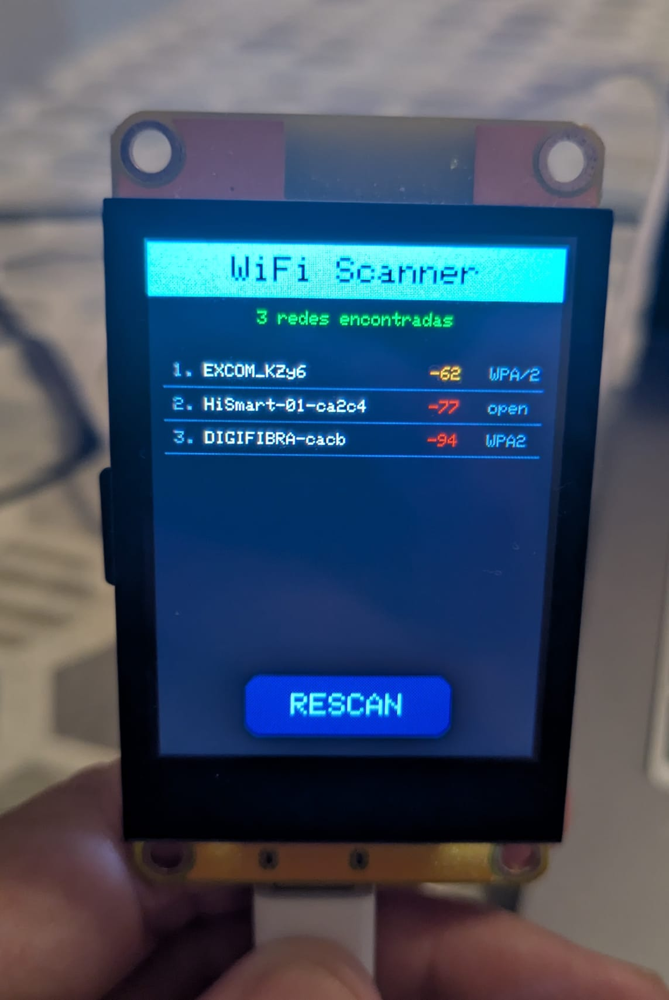

# WiFi Scan - ESP32-2432S022

Escáner de redes WiFi cercanas con resultados en pantalla: SSID,
intensidad de señal (RSSI) y tipo de cifrado. Botón táctil **RESCAN**
para repetir el escaneo cuando se quiera.

## Qué hace

1. Inicializa pantalla (ST7789, bus paralelo) y táctil (CST816S)
2. Al arrancar, pone el WiFi en modo estación (`WIFI_STA`) y lanza
   un escaneo de redes cercanas
3. Muestra en pantalla hasta 10 redes, ordenadas como las devuelve
   `WiFi.scanNetworks()`, con:
   - Nombre (SSID, truncado a 16 caracteres; "(oculta)" si no emite nombre)
   - RSSI en dBm, coloreado según calidad de señal
   - Tipo de cifrado (open, WEP, WPA, WPA2, WPA3, WPA2 Enterprise...)
4. También vuelca el listado completo por el puerto Serie
5. Botón **RESCAN**: repite el escaneo bajo demanda, con feedback
   visual al pulsar (el botón cambia de color brevemente)

## Captura



## Código de colores de señal (RSSI)

| RSSI | Color | Calidad |
|---|---|---|
| ≥ -60 dBm | Verde | Buena |
| -60 a -75 dBm | Naranja | Media |
| < -75 dBm | Rojo | Débil |

## Hardware

- Placa ESP32-2432S022 (pantalla ST7789 2.2", 240x320, bus paralelo 8080)
- Táctil capacitivo CST816S (I2C)
- No necesita ningún componente externo adicional

## Pines utilizados

**Pantalla (bus paralelo 8080, ya validados):**

| Función | Pin | | Función | Pin |
|---|---|---|---|---|
| WR | 4 | | D3 | 14 |
| RD | 2 | | D4 | 27 |
| RS | 16 | | D5 | 25 |
| CS | 17 | | D6 | 33 |
| D0 | 15 | | D7 | 32 |
| D1 | 13 | | Backlight | 0 |
| D2 | 12 | | | |

**Táctil CST816S (I2C):**

| Función | Pin |
|---|---|
| SDA | 21 |
| SCL | 22 |
| Dirección I2C | 0x15 |

## Librerías necesarias

- [LovyanGFX](https://github.com/lovyan03/LovyanGFX)
- `WiFi.h`, `Wire.h` (incluidas en el core de ESP32)

## Entorno probado

- Arduino IDE
- Core ESP32 (Espressif Systems): **v3.1.3**

## Salida esperada por Serial

```
=== WiFi Scanner ESP32-2432S022 ===
 1  MiRouter_5G            -52 dBm  WPA2
 2  Vecino_WiFi             -68 dBm  WPA2
 3  (oculta)                -80 dBm  WPA3
```

## Notas

- El escaneo puede tardar unos segundos; durante ese tiempo la
  pantalla muestra "Escaneando redes..."
- Si no aparece ninguna red, revisa que la placa tenga antena/entorno
  con cobertura — `WiFi.scanNetworks()` devolviendo 0 no es un fallo
  de la placa sino ausencia de redes visibles

## Próximos pasos

Posible ampliación: guardar el listado en la SD (reutilizando el
proyecto `sd-card-test/`) para tener un log histórico de redes
detectadas por ubicación.
